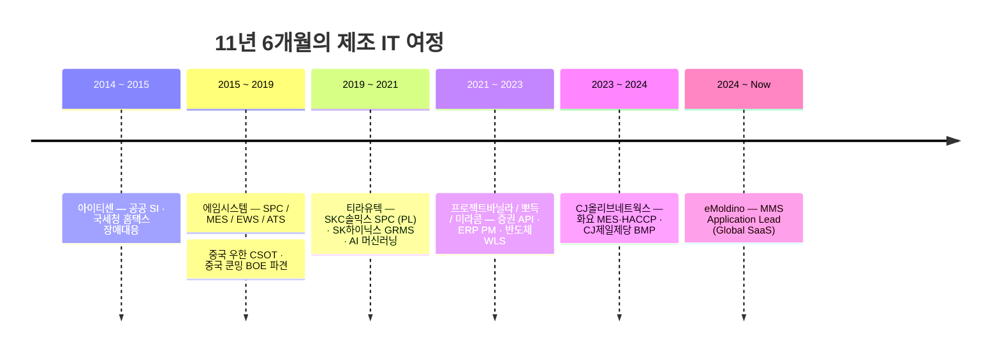

<div align="center">
  
</div>

<div align="center">

  <a href="https://git.io/typing-svg">
    
  </a>

  <br/><br/>

  
  
  
  <br/>
  <a href="https://ddinggo.tistory.com"></a>
  <a href="https://thirsty-swing-651.notion.site/DDingo-Coder-1682654d6ac74f11b7e1dbea0afad14e"></a>
  <a href="mailto:ddingoa21@gmail.com"></a>
  

</div>

<br/>

> **공장 현장의 데이터를 시스템으로 바꾸는 일을 11년 해왔습니다.**
>
> LOT 하나가 어떤 설비를 지나 어떤 품질값을 남기는지 — 그 흐름을 추적하고, 이상을 감지하고, 자동으로 알리는 시스템을 만듭니다.
> MES·SPC·RMS 같은 스마트팩토리 코어 시스템을 **설계부터 운영까지** 책임져 왔고,
> 지금은 글로벌 제조사를 고객으로 하는 SaaS의 **백엔드 Application Lead**로 일하고 있습니다.

<br/>

<div align="center">

| 🏭 제조IT 경력 | 🎯 리딩 경험 | 🌏 해외 파견 | 📦 수행 프로젝트 |
|:---:|:---:|:---:|:---:|
| **11년 6개월** | **PL · PM · Lead 5회** | **중국 2회** | **14+** |

</div>

<br/>

---

## 🔭 Currently

```yaml
company : eMoldino
role    : Application Lead (Backend)
product : MMS — Mold Management System (Global B2B SaaS)
clients : Zebra · Dyson · P&G · Honeywell · Eaton
stack   : Java · Spring Boot · MySQL · AWS (EC2/S3/SES)

doing   :
  - 금형 센서(Shot·온도·가속도·위치) 실시간 수집·분석 파이프라인 설계
  - 신규 기능 아키텍처 설계 및 코드 리뷰
  - 글로벌 고객사 맞춤 알림 시스템 구축
  - 배포 · 운영 프로세스 개선

learning: [ MSA, Kafka, Kubernetes, LLM Application ]
```

<br/>

---

## 🏭 Domain Expertise

> 제 가장 큰 강점은 **제조 시스템 전 영역을 하나의 흐름으로 이해한다**는 점입니다.
> 각 시스템을 따로 배운 게 아니라, 현장에서 서로 물려 돌아가는 것을 직접 만들면서 익혔습니다.

| 시스템 | 정식 명칭 | 무엇을 하는가 | 내가 한 일 |
|:---|:---|:---|:---|
| **MES** | Manufacturing Execution System | LOT 추적, 공정·설비 제어, 작업지시, 물류 흐름 | 화면 설계·개발 (230본 중 **110본+** 담당), 설비통신(EDA) 연동 |
| **SPC** | Statistical Process Control | 공정능력지수(Cp/Cpk) 산출, 룰 기반 품질 이상 감지 | **PL로 프로젝트 총괄**, 스케줄러·알람 발송 신규 구현 |
| **EWS** | **Early** Warning System | SPC 고도화 — 이상 징후 조기 경보 | **UI 리더**, 화면 설계·고객 미팅·업무 할당 총괄 |
| **RMS** | Recipe Management System | 설비 레시피 버전 관리 및 배포 | 레거시 → Web 전환, 레시피 매핑·인터락 기능 설계 |
| **MMS** | Mold Management System | 금형 수명·품질 관리 (IoT 센서 기반) | **백엔드 설계·운영 총괄 (현재)** |
| **WLS** | Wafer Logistics System | 웨이퍼 Map 파일 고객사별 전송 | 기준정보 기반 FTP/SFTP 전송 규칙 엔진 개발 |
| **ATS** | Analysis Tracking System | MES 전 로그의 대용량 처리·조회 | MongoDB + Oracle **듀얼 스토리지** 구조 설계 |
| **ERP / HACCP** | — | 생산·수불·품질 관리, 식품 위해요소 관리 | ERP 구축 **PM**, 주류공장 MES·HACCP 운영/고도화 |

<br/>

---

## 🚀 Tech Stack

<table>
<tr><td width="150"><b>Language</b></td><td>


</td></tr>

<tr><td><b>Backend</b></td><td>


</td></tr>

<tr><td><b>Frontend</b></td><td>


</td></tr>

<tr><td><b>Database</b></td><td>


</td></tr>

<tr><td><b>Cloud / DevOps</b></td><td>


</td></tr>

<tr><td><b>Data / ML</b></td><td>


</td></tr>

<tr><td><b>Visualization</b></td><td>


</td></tr>

<tr><td><b>Tools</b></td><td>


</td></tr>
</table>

<br/>

---

## 💼 Career Timeline



<details>
<summary><b>📋 상세 경력 펼쳐보기</b></summary>

<br/>

| 기간 | 소속 | 역할 | 주요 업무 |
|:---|:---|:---|:---|
| `2024.11 ~ 현재` | **eMoldino** | Application Lead | MMS 백엔드 설계·운영 총괄 |
| `2023.07 ~ 2024.10` | **CJ올리브네트웍스** (프리랜서) | 운영/개발 | 화요 MES & HACCP, CJ제일제당 BMP |
| `2022.11 ~ 2023.05` | **미라콤아이앤씨** | 대리 | 하나마이크론 WLS 웨이퍼 Map 전송 |
| `2022.03 ~ 2022.10` | **뽀득** | ERP PM / 기술 PM | ERP·MES 구축, 생산 모니터링 시스템 |
| `2021.09 ~ 2022.01` | **프로젝트바닐라** | 서버 개발 | 증권 앱 API 서버 · 증권사 중계서버 |
| `2019.06 ~ 2021.08` | **티라유텍** | 책임연구원 | SKC솔믹스 SPC(PL), SK하이닉스 GRMS, AI ML |
| `2015.11 ~ 2019.05` | **에임시스템** | 선임 → 책임연구원 | CSOT SPC, BOE MES, SK이노 EWS/RMS, ATS |
| `2014.08 ~ 2015.07` | **아이티센** | 사원 | 공공 SI 제안, 국세청 홈택스 장애 대응 |

</details>

<br/>

---

## ⭐ Project Highlights

<table>
<tr>
<td width="50%" valign="top">

### 🔩 eMoldino MMS
**Global B2B SaaS · Application Lead**
`2024.11 ~ 현재`

금형에 부착된 IoT 센서로 **Shot 수 · 온도 · 가속도 · 위치**를 실시간 수집·분석해 금형 수명과 품질을 관리하는 글로벌 SaaS.

- 백엔드 아키텍처 설계 및 운영 총괄
- 고객사별 데이터 파이프라인 · 알림 시스템 구축
- **글로벌 4개사 PoC 성공** → 서비스 확장 기반 확보

`Java` `Spring Boot` `MySQL` `AWS`

</td>
<td width="50%" valign="top">

### 🇨🇳 BOE 쿤밍 MES
**VR 소자 공장 현지 파견 · MES OI Main**
`2018.11 ~ 2019.01`

중국 쿤밍 BOE VR 소자 제작 공장에 상주하며 MES 화면 설계·개발.

- 전체 **230본 중 110본 이상** 단독 담당
- **60일 내 100본+ 완성**
- 설비통신(EDA) 연동 실무 경험 축적

`C#` `DevExpress` `Java` `Oracle 11g`

</td>
</tr>
<tr>
<td width="50%" valign="top">

### 📈 SKC 솔믹스 SPC
**MES/SPC/QMS/PMS 구축 · PL**
`2019.08 ~ 2020.05`

솔믹스 공장 SPC 메인 개발을 맡으며 **PL로서 고객 니즈 분석 · 화면 설계 · 일정 협의 · 기능 개발**을 총괄.

- 스케줄러 · 알람 발송 기능 신규 설계·구현
- 팀원 2명 리딩

`C#` `MSSQL` `Socket`

</td>
<td width="50%" valign="top">

### 🤖 제조 데이터 ML 시스템
**불량인자 예측 · 합불 판정**
`2021.01 ~ 2021.08`

기존 SPC에 머신러닝을 접목해 **의사결정나무 · PLS · AdaBoost** 기반 인과관계 분석과 불량 예측을 제공.

- 데이터 전처리 · 알고리즘 연동 · 화면 · 서버 · DB 전 영역 개발
- **에코프로비엠 실적용**

`Python` `Django` `C#/WPF` `MSSQL`

</td>
</tr>
</table>

<br/>

---

## 📊 GitHub Stats

<div align="center">
  
  
  <br/><br/>
  
  <br/><br/>
  
</div>

<br/>

---

## 🧭 How I Work

<div align="center">

| | |
|:---|:---|
| 🎯 **끝까지 하자** | 시작한 일은 끝을 볼 때까지. 원인을 끝까지 추적해서 해결합니다. |
| 🤝 **혼자보다 함께** | 협업에서 신뢰를 빠르게 쌓고, 팀의 분위기를 끌어올리는 편입니다. |
| 🏭 **현장을 개선하는 개발자** | 코드를 넘어 현장의 요구를 시스템으로 해석하는 것을 중요하게 생각합니다. |
| ➕ **+1의 성장** | 100에서 101로. 작지만 꾸준한 성장이 결국 조직의 성장이라 믿습니다. |

</div>

<br/>

---

<div align="center">

### 📫 Get in Touch

<a href="mailto:ddingoa21@gmail.com"></a>
<a href="https://ddinggo.tistory.com"></a>
<a href="https://thirsty-swing-651.notion.site/DDingo-Coder-1682654d6ac74f11b7e1dbea0afad14e"></a>

<br/><br/>


</div>
